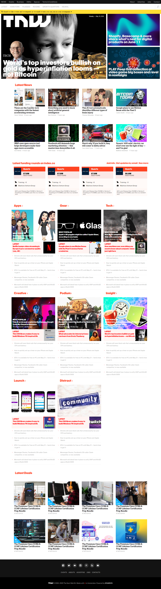

# Responsive Design

> This project consist of building a responsive desgign of the [The Next Web](https://thenextweb.com/) website.



## Requirements:

- Align elements with float, grid or flex.
- Use article tags for all articles listed.
- Make the web responsive for different viewport. 

## Built With

- CSS and HTML

## Live Demo

[Live Demo Link](https://raw.githack.com/yahir91/TheNextWeb/version1/index.html)


## Getting Started

To get a local copy up and running follow these simple example steps.

1. Open the terminal comand line window
2. ``` git clone https://github.com/yahir91/TheNextWeb.git ```
3. Open the index.html with your favorite browser
4. Enjoy!


## Authors

👤 **Jessica Farias**

- Github: [jessicafarias](https://github.com/jessicafarias)
- Twitter: [@FariasRosado](https://twitter.com/FariasRosado)
- Linkedin: [jessica-michelle-farias-rosado](https://www.linkedin.com/in/jessica-michelle-farias-rosado/)

👤 **Yahir Cardona**

- Github: [@yahir91](https://github.com/yahir91)
- Twitter: [@YahirCardona3](https://twitter.com/YahirCardona3)
- Linkedin: [linkedin](https://www.linkedin.com/in/osmar-yahir-cardona-reyes-54b40b1a7/)


## 🤝 Contributing

Contributions, issues and feature requests are welcome!

Feel free to check the [issues page](issues/).

## Show your support

Give a ⭐️ if you like this project!
